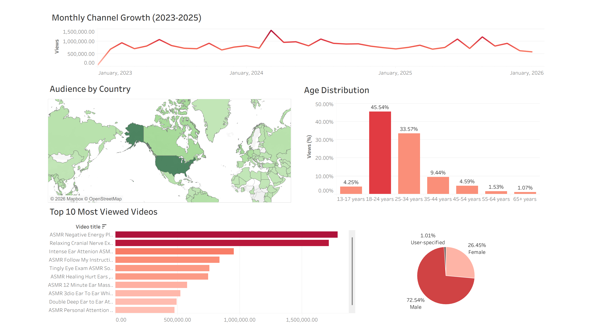

# YouTube Channel Viewer Analysis (2023-2025)

## Table of Contents
- [Business Questions](#buisness-questions)
- [Exploratory Questions](#exploratory-questions)
- [Project Overview](#project-overview)
- [Summary of Insights](#summary-of-insights)
- [Limitations](#limitations)
- [Recommendations](#Recommendations)

## Business Questions 
- Which videos generate the highest viewership?
- Who is the primary audience demographic of the channel?
- Where are viewers located geographically?

## Exploratory Questions
- How has channel viewership changed over time between 2023 and 2025?
- Do a small number of videos drive the majority of total views?
- Are views primarily coming from subscribers or new audiences discovering the channel?

## Project Overview
This project analyzes YouTube channel performance using data exported from YouTube Studio between 2023 and 2025. An interactive Tableau dashboard was created to explore trends in viewership growth, identify top-performing videos, and analyze audience demographics including geographic distribution, age groups, gender breakdown, and subscriber engagement.

The objective of this project is to understand which types of content drive the most engagement, identify the channel’s core audience, and examine how viewership evolves over time.

### Data Collection
The datasets used in this project were exported directly from YouTube Studio analytics. Separate exports were used to analyze monthly channel growth, video-level performance, audience demographics, geographic distribution, and subscriber engagement metrics.

### Dashboard Preview 
Full Dashboard Overview

The full Tableau interactive dashboard can be found [here](https://public.tableau.com/app/profile/karl.r6258/viz/ASMR_Youtube_17727215829430/YoutubeAnalysisDashboard)

## Summary of Insights

### Channel Growth Trends
From 2023 to 2025, the channel experienced substantial growth in total viewership. Monthly views increased from approximately 59K views in January 2023 to a peak of roughly 1.4 million views in March 2024, representing a significant expansion in audience reach within a relatively short period. The steady upward trajectory suggests increasing visibility through YouTube’s recommendation system and growing audience engagement as the channel produced more content.

### Content Performance
A small number of videos generate a disproportionately large share of total views. Many of the highest-performing videos share similar characteristics, particularly immersive ASMR formats such as medical roleplays (cranial nerve exams, eye exams) and personal attention triggers including ear care, follow my instructions scenarios, and ear-to-ear whispering. These formats create highly engaging experiences that appear to resonate strongly with viewers.

### Audience Demographics
The channel primarily attracts a young adult audience. Viewers aged 18–24 represent the largest segment at 45%, followed by 25–34 year olds at 33%, meaning that nearly 78% of the audience falls within the 18–34 demographic range. Gender distribution shows a strong skew toward male viewers, with 72% male and 26% female viewers, indicating that the channel’s content currently resonates more strongly with male audiences.

### Geographic Distribution 
Viewership is concentrated in several key countries, with the United States generating approximately 10.9 million views, making it the dominant audience market. Other major viewer locations include the United Kingdom with roughly 1.74 million views, Canada with about 1.43 million views, and surprisingly, the Philippines with approximately 1.19 million views. This distribution demonstrates that while the channel’s largest audience is in the United States, it also maintains a strong international presence.

### Subscriber Engagement
A majority of channel views originate from non-subscribed viewers. Approximately 65% of views come from non-subscribers, indicating that the channel benefits heavily from YouTube discovery features such as search results and recommendation algorithms. While this suggests strong discoverability, it also highlights a potential opportunity to increase subscriber conversion and build a larger base of returning viewers.

## Limitations
- Demographic and geographic datasets were exported as aggregated snapshots and do not contain time-based fields, limiting the ability to analyze how audience composition changes over time.
- The analysis focuses primarily on viewership metrics and does not incorporate deeper engagement indicators such as audience retention or click-through rates.
- Because the data originates from YouTube Studio exports, some metrics are aggregated and may not capture more granular viewer behavior.
  
## Recommendations
- Analyze patterns among the highest-performing videos to identify repeatable content formats that consistently drive engagement.
- Explore strategies to convert non-subscriber viewers into subscribers through stronger calls to action and engagement prompts.
- Continue monitoring viewership trends to identify which types of content generate spikes in channel growth.

 
